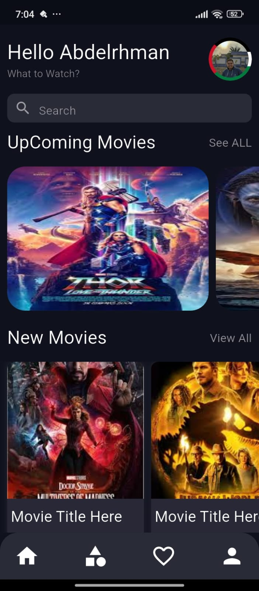
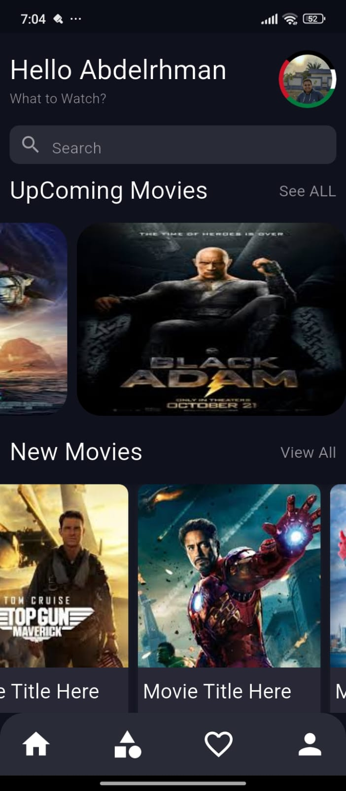
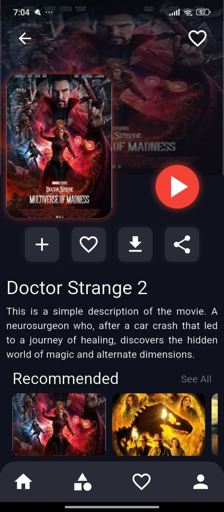
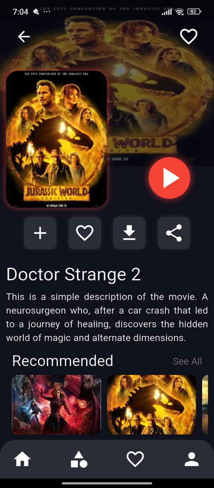

# 🎬 Movies App UI Design in Flutter

This repository showcases a Flutter-based UI design for a Movies App, demonstrating a clean and modern interface suitable for movie browsing applications.

---

## 📸 Screenshots

### Home Screen


*Home Screen showcasing trending movies.*

### Movie Details


*Detailed view of a selected movie.*

---

## 🚀 Getting Started

To explore or modify this UI design:

1. **Clone the repository:**
   ```bash
   git clone https://github.com/AbdelrhmanAhmed200/-Movies-App_UI_Design_In_Flutter.git


## Requirements

Flutter SDK

Android Studio or VS Code

Emulator/Physical Device


## Author

- [@AbdelrhmanAhmed200](https://github.com/AbdelrhmanAhmed200)


## Contact
For any inquiries, reach out to:

Developer: Abdelrhman Ahmed

Email: abdelrahmanahmedfarid988@gmail.com
